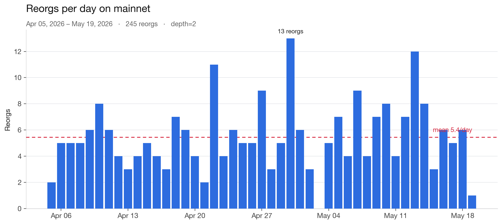
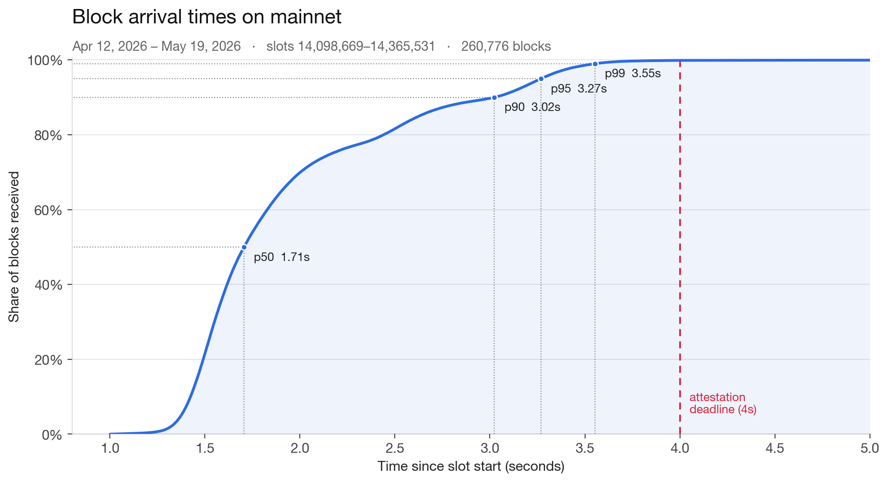
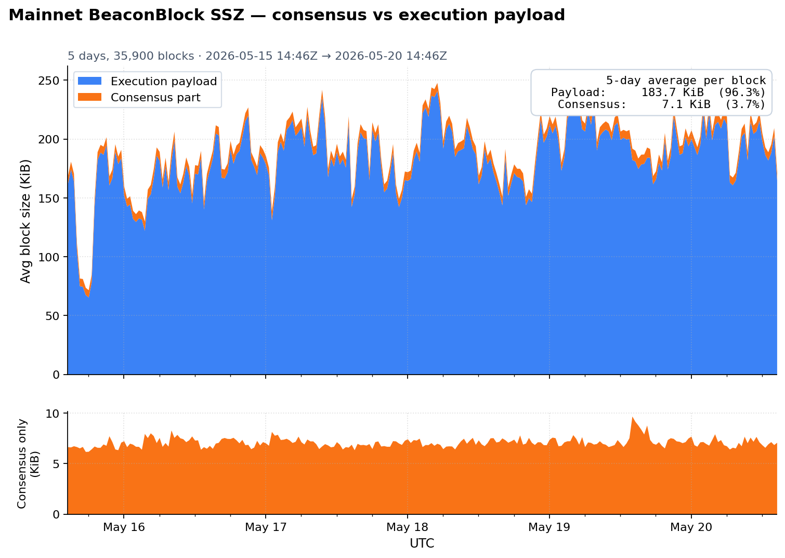
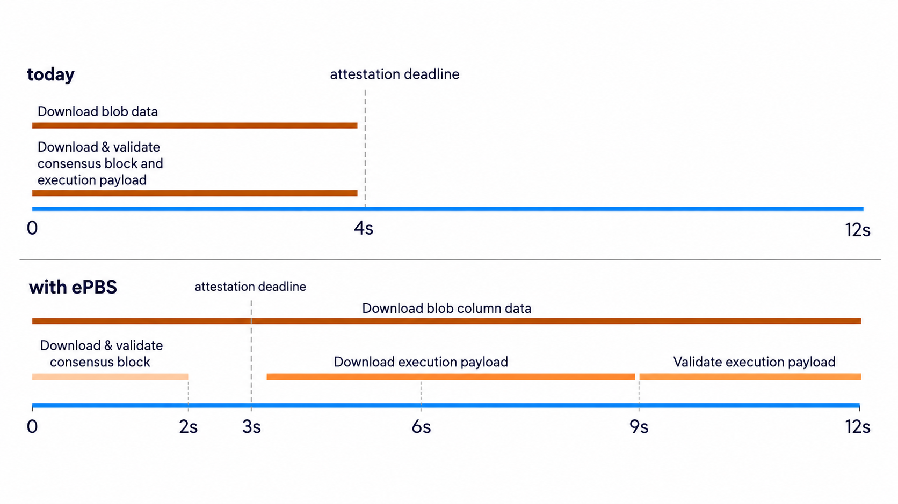

[The news is out](https://blog.ethereum.org/2026/05/02/soldogn-interop-recap): Ethereum's next upgrade, [Glamsterdam](https://forkcast.org/upgrade/glamsterdam), is targeting 200M gas as the floor, along with a much higher blob limit than today.

Glamsterdam's scaling target is made possible by three EIPs: [ePBS](https://eips.ethereum.org/EIPS/eip-7732), [BALs](https://eips.ethereum.org/EIPS/eip-7928), and [state creation cost increases](https://eips.ethereum.org/EIPS/eip-8037). ePBS gives execution more time, BALs give execution more headroom, and state creation cost increases make sure scaling does not turn into runaway state growth.

This post focuses on how ePBS fundamentally changes how Ethereum scales in Glamsterdam.

ePBS is often described as proposer-builder separation, or as a market structure improvement that moves the out-of-protocol relayer role into the protocol. That is true, but it undersells the scaling impact, which was the main reason ePBS became a headliner for Glamsterdam.

In [Fusaka](https://ethereum.org/roadmap/fusaka/), Ethereum shipped data availability sampling with KZG. That upgrade combined cryptographic and networking updates, and fundamentally changed how Ethereum scales data availability.

In Glamsterdam, Ethereum will change how it scales again, but this time in a simpler way: it uses more of the slot.

Ethereum is bottlenecked by bandwidth and compute today. Nodes on the network need enough bandwidth to download blocks and blobs on time, and enough compute to verify them on time. If they miss the deadline, the block is much less likely to receive timely attestations, which increases reorg risk and turns the slot into a missed opportunity for useful throughput.

*Tight timing margins turn late blocks into reorg risk.*

Increasing the execution gas limit and blob count is hard because larger payloads and more blobs take longer to propagate and longer to verify. Scaling without changing how Ethereum uses the slot today would favor nodes with better bandwidth, faster hardware, and better network position, which weakens Ethereum's decentralization.

Ethereum today has 12 second slots, but not all 12 seconds are used for throughput. The attestation deadline is 4 seconds into the slot. That means validators need to download and verify everything before then. A proposer also has to choose when to release its block, trading off more time for MEV against the risk of missing the deadline. Waiting longer gives the proposer more time to pack valuable transactions, but increases the risk that validators do not receive and verify the block in time. After 4 seconds, the remaining 8 seconds of the slot are mostly used for consensus vote aggregation, not used for increasing execution throughput or blob capacity.

*Block arrival timing shows why the early-slot window is already tight.*

Once we understand timing as the bottleneck, we can look at the network data. There are three main pieces of data that matter for slot timing: the consensus block, the execution payload, and blobs.

The consensus block is small compared to the execution payload and blob data. On mainnet, it is often only a small fraction of the total data nodes need to download in a slot. Meanwhile, user transactions are not in the consensus block itself. They are in the execution payload and blobs, and those are the objects that need more time to download and verify.

*Most download is execution payload, not consensus data.*

ePBS changes the slot from one shared deadline into multiple deadlines. The core idea of ePBS is to separate the consensus part of the block from the execution part of the block, so they become separate network objects with separate deadlines. Today, they share the same timing-critical deadline for download and verification. Validators need to receive and verify both before they can attest. With ePBS, the consensus block commits to the payload, and the payload is revealed later. This changes Ethereum's slot anatomy. Instead of forcing everything into the first few seconds of the slot, ePBS introduces separate deadlines for the beacon block, execution payload, and blobs.

Separate deadlines let the protocol give the payload and blobs more time to propagate and be verified. The beacon block can arrive first, then the payload can arrive later, and blobs can have their own deadline.

Today, with a 4 second attestation deadline, if a proposer releases its block 1–2 seconds into the slot, the block and blobs may arrive around 2–3 seconds into the slot. That leaves a node only 1–2 seconds to download and verify everything.

With ePBS, suppose the beacon block deadline is 3 seconds, the payload deadline is 6 seconds, and the blob deadline is near the end of the slot. The payload now has 6 seconds to download and verify, which gives nodes more time to receive and execute it before the next slot. Blobs now have around 9 seconds to propagate across the network.

That is the main reason Ethereum can target a large scaling increase without putting more pressure on decentralization. The exact deadlines can still change, but the direction is clear: Ethereum starts using more of the 12 second slot for useful scaling work.

Separating the beacon block from the execution payload also creates a new problem. What happens if validators agree on the beacon block, but disagree on whether the execution payload arrived on time?

Payload ambiguity is dangerous because validators can agree on the beacon block while disagreeing on whether the payload was available in time. ePBS needs a way to resolve that ambiguity without letting the slot fall apart. That is where the Payload Timeliness Committee comes in. We will cover that in the next post.
