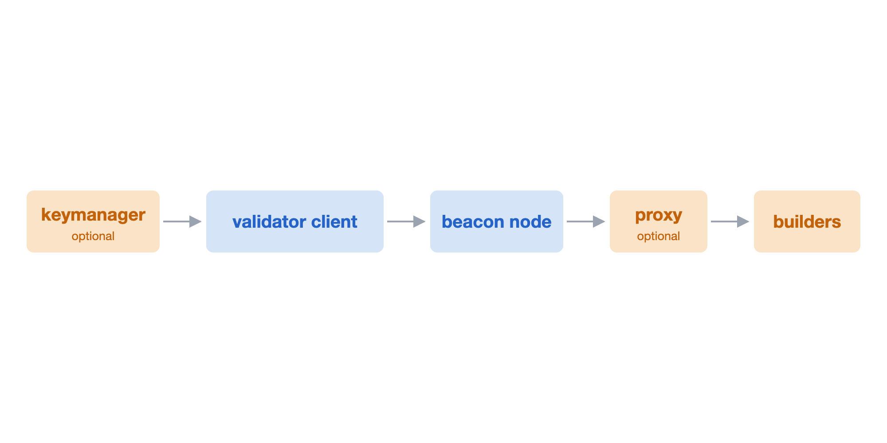

The last post [How ePBS resolves payload ambiguity](/writing/how-epbs-resolves-payload-ambiguity/) explained how Ethereum comes to consensus on whether the payload arrived on time. That post and the one before it took the bid inside the block as a given, and the protocol takes over from there. This post is about what happens before that, the exchange between the proposer and the builder that lets the proposer select which builder's bid goes into its block. Bid selection is the main thing a node operator will have to look into and configure. In ePBS, builder selection changes from today's sidecar model into the protocol itself, and the proposer's configuration and the exchange APIs that different clients use to build blocks have to change with it.

Today, [MEV-Boost](https://github.com/flashbots/mev-boost) and [Commit-Boost](https://github.com/Commit-Boost/commit-boost-client) are sidecars and out of protocol. The beacon node talks to relays through the sidecar, and the protocol does not see the builder and proposer exchange. The proposer's decision over the outcome is just a single scalar, the `builder_boost_factor` it passes on the [produceBlockV3](https://ethereum.github.io/beacon-APIs/#/ValidatorRequiredApi/produceBlockV3) request, which weighs the builder's block value against the local block value. Everything else, which relays to use, the minimum bid to accept, circuit breakers, lives in client-specific flags on the beacon node side, and every client behaves differently. Operators have been asking for a standard here for years.

ePBS changes the structure of the decision. Bids have become in-protocol objects and builders have become staked in the beacon state. Builders sign their bids, and their payment is enforced trustlessly by the protocol. The beacon node collects bids over gossip and from builders it dials directly, then picks one. Proposers no longer need out of protocol software to reach a builder. The relay becomes completely optional in ePBS.

With builder identities on chain, proposers have more variables to consider in choosing which bid to include. A proposer may trust one builder's out of protocol value fully, another's up to a certain limit, and a third's not at all. A proposer may trust a builder less because it has seen censorship from them. The decision input is no longer one dimension, a boost factor, and it differs per validator key and per builder. For example, a staking pool may run different policies for different customers or applications. It helps to see the whole path this configuration travels through different APIs.



*The path a proposer's builder configuration travels.*

An optional keymanager holds per-key settings and pushes them to the validator client. The validator client turns them into signed, per-slot requests. The beacon node receives the proposer's preferences on the block production request and filters them to the bids it collects. An optional proxy sits between the beacon node and the builders and forwards proposer requests without touching any keys.

Separation of concerns is nice, each hop has its own job, but it leaves gaps. The hop that has the information is not the hop that makes the decision. The configuration lives at the validator client, keyed per validator, but the bid selection decision happens in the beacon node at block production time. The beacon node has to learn what the proposer wants, which builders to consider and how much to trust each one. The natural place to share such preferences is the block production request itself. A long list of per-builder preferences no longer fits in query parameters, which is why the beacon API is updating to a POST version of produceBlockV4. The validator client sends its builder preferences in the request body, and the beacon node filters them to the bids it collects. Carrying the preferences on the block request also means the beacon node stays stateless. If preferences were pushed ahead of time and cached, the beacon node takes on cache complexity. There is also an alt flow under discussion, where the validator client fetches bids itself and hands the winning bid to each of its beacon nodes. That flow matters for validator clients that run against multiple beacon nodes, where every beacon node fetching the same bids would waste work and could pick different winners.

So what must each builder entry express? Start with why requests are signed at all. A builder may not want to serve bids to anyone who asks. It may only want to share the bid amount with a legitimate proposer, and it needs proof that the request in front of it came from that proposer. So the validator client authenticates every request with a signature. The naive thing to sign is the builder's URL, along with the slot. The signature proves which proposer is asking, and the signed URL ties the request to one builder, so it cannot be replayed to another.

What the naive option fails to cover is that operators may run a proxy in front of several builders, so the address a request is dialed to may not be the builder identity it signs over. And if a builder moves to a new host, that breaks the auth, because the URL the proposer signed no longer matches.

The better fix is to separate identity from transport. The signed value becomes `auth_data`, bytes the proposer and the builder agree on ahead of time. The URL becomes plain routing information, just where to dial. For a builder with no negotiated terms, `auth_data` is just the UTF-8 bytes of its url. If a request is routed to the wrong builder, that builder sees `auth_data` it does not know and rejects it, so the auth fails.

The following example shows what one builder entry in the proposer's configuration looks like. `url` is where the builder is dialed. `pubkey` is the builder's staked key, the same key that signs its bids. A proxy needs no field of its own. An operator points the url at the proxy and sets `auth_data` to identify the downstream builder, and the beacon node forwards the signed bytes unchanged. The last three fields configure how the builder's bids compete and get chosen on the proposer side.

*Before, the url doubles as the signed identity.*

```json
{
  "url": "https://builder-a.example.com",
  "pubkey": "0x93247f2209ab...b56f43611df74a",
  "max_execution_payment": "250000000",
  "min_bid": "10000000",
  "builder_boost_factor": "100"
}
```

*After, auth_data is the signed identity, and the url is just where to dial.*

```json
{
  "url": "https://builder-a.example.com",
  "auth_data": "0x123123123abc...",
  "pubkey": "0x93247f2209ab...b56f43611df74a",
  "max_execution_payment": "250000000",
  "min_bid": "10000000",
  "builder_boost_factor": "100"
}
```

`auth_data` does more than routing. It can be anything the proposer and the builder agree on, including bytes the builder itself signed. Imagine a builder signing a commitment, say a preconfirmation promise, and returning the signed bytes to the proposer. The proposer uses those bytes as its `auth_data` and signs over them. The result is an agreement signed by both parties. The builder's signature proves it made the promise. The proposer's signature proves it accepted the promise for a given slot. And no proxy touched validator keys at any point. Proposer commitment protocols can build on this primitive.

Moving on to the bid selection fields, starting with the one that carries over from today. A per-builder `builder_boost_factor` makes one builder's bids more or less likely to win against others and against the local block.

Max execution payment is a new field. A bid's protocol payment is trustless, the builder is staked and the transfer settles on chain. But a bid may also promise execution layer payment inside the payload itself, a transfer to the fee recipient that the beacon node does not verify at selection time. Pricing that promise into bid selection means trusting the builder to deliver it, the same trust that sits with out of protocol relayers today. A per-builder cap, `max_execution_payment`, bounds how much unverified promise the beacon node is willing to accept. A conservative proposer might give a builder it has never seen zero trusted value, and that builder's bids compete on trustless payment alone.

The floor value works the same as today. A per-builder `min_bid` refuses bids below a threshold.

Finally, defaults keep most cases simple. A homestaker may just want to write one default preference config that applies to every validator key. A pool should be able to override it per validator key and per builder. Those defaults live with whoever writes the config. What travels over the API is fully resolved, one complete document per key with every field spelled out, and `pubkey` is the only optional builder field. The validator client never reasons about an inheritance chain where it holds one set of defaults and the request body carries another. Resolution is the caller's job, since the caller owns its own config setup. A proposed keymanager API endpoint, `/eth/v1/validator/config`, manages fee recipient, gas limit, graffiti, and the full builder preference set as one document per key, retiring narrower keymanager operations in the process. That format is now headed toward a standard, pending community feedback.

*Before, three narrow endpoint families, nine operations.*

```
GET    /eth/v1/validator/{pubkey}/feerecipient
POST   /eth/v1/validator/{pubkey}/feerecipient
DELETE /eth/v1/validator/{pubkey}/feerecipient

GET    /eth/v1/validator/{pubkey}/gas_limit
POST   /eth/v1/validator/{pubkey}/gas_limit
DELETE /eth/v1/validator/{pubkey}/gas_limit

GET    /eth/v1/validator/{pubkey}/graffiti
POST   /eth/v1/validator/{pubkey}/graffiti
DELETE /eth/v1/validator/{pubkey}/graffiti
```

*After, one endpoint and one document per key. An empty document is the delete.*

```
GET  /eth/v1/validator/config
POST /eth/v1/validator/config
```

```json
{
  "data": {
    "configs": {
      "0xa057816155...4070efcd75140eada5ac83a92506dd7a": {
        "fee_recipient": "0x50155530FCE8a85ec7055A5F8b2bE214B3DaeFd3",
        "target_gas_limit": "45000000",
        "graffiti": "example graffiti",
        "builder": {
          "enabled": true,
          "builders": [
            {
              "url": "https://builder-a.example.com",
              "auth_data": "0x68747470733a2f2f6275696c6465722d612e6578616d706c652e636f6d",
              "pubkey": "0x93247f2209ab...b56f43611df74a",
              "max_execution_payment": "250000000",
              "min_bid": "10000000",
              "builder_boost_factor": "100"
            }
          ]
        }
      }
    }
  }
}
```

The last two posts were about the protocol part of ePBS, the enforced bids, the reveal deadline, and the PTC. This post was about builder selection. Once builders are identities the protocol can see, the proposer's opinion about each of them needs a wire format and a config format. That is what these APIs are growing to support.
