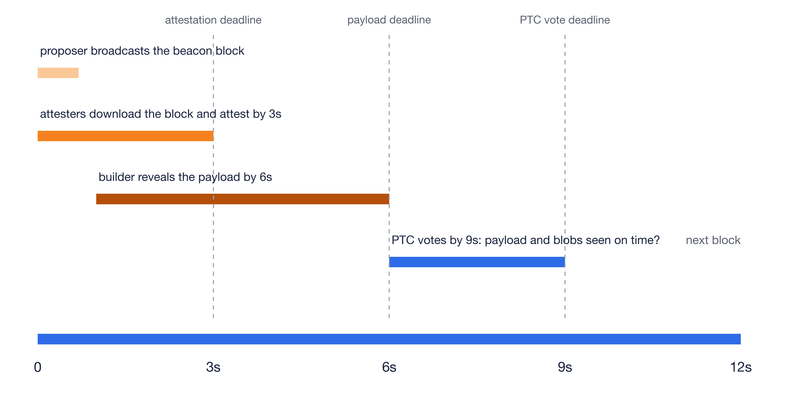
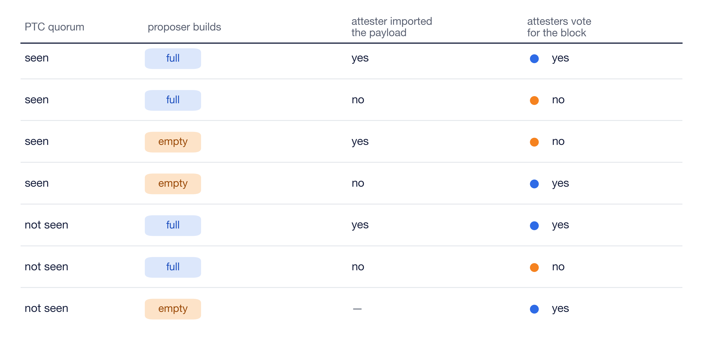

The last post [ePBS changes how Ethereum scales](/writing/epbs-changes-how-ethereum-scales/) ended on an open question. [ePBS](https://eips.ethereum.org/EIPS/eip-7732) separates the consensus block from the execution payload, and the consensus block is attested before the payload is revealed. Validators can agree that the consensus block arrived on time while disagreeing on whether its payload did. This post covers how ePBS resolves payload ambiguity: a sampled committee votes inside the slot on whether the payload and blobs were revealed on time.

One naive solution: let the next slot's attesters vote on whether the previous slot's payload was revealed on time. This introduces the least amount of changes, since local fork choice rules are out of consensus. We could define a rule that declares a payload canonical, checked by the next slot's attesters: the payload arrived on time.

What this doesn't provide is a hint to the next slot's proposer. Attesters in the current slot vote 3 seconds into the slot, but the payload is revealed later, 6 seconds into the slot. Because of that, the current slot's attestations carry no payload information. We fail to get an aggregated view of the payload until the next slot's attestations, and by then the next slot's proposer has already committed to a parent.

This makes the next slot's proposer's job harder. It must choose to build on either the block with its payload (full) or the block without it (empty) by using only its local view. If it picks the side the majority of attesters did not see, its own block gets orphaned. A malicious builder can grief a single proposer node easier than a committee of nodes.

In Gloas, ePBS fixes this with a new voting round after the payload reveal deadline. Each slot, 512 validators are sampled from that slot's committees, weighted by balance. They form the Payload Timeliness Committee. At 9 seconds into the slot, each member broadcasts a signed vote signaling two things: did the payload arrive on time, and did the blobs. The vote is only for seeing the payload and blobs, no need to execute them yet, so votes are fast to cast.

The deadline matters because a rational builder may want to reveal as late as possible. Until the payload is revealed, the builder is the only party that knows the post execution state, and that monopoly is valuable because competitors get less time to build the next block, and the builder can sell preconfirmations against a state only it knows. The reveal deadline bounds how much of the slot the winning builder's advantage can cover. The gap between the payload reveal and payload attestation intervals also ensures there's sufficient time for a builder or proposer to import and build a block for the next slot.

*One slot under ePBS: the PTC votes after the payload deadline.*

Payload timeliness is used in the fork choice rule. Every slot has two possible states: full, the block with its payload, or empty, the block without it. The PTC quorum, a majority of more than 256 of the 512, is what the fork choice rule uses to choose between full and empty, and it only applies to the previous slot's block during the current slot. In later slots, regular attestation support takes over and the PTC votes no longer matter.

An honest proposer should follow the PTC quorum: build on full if the committee saw the payload in time, otherwise build on empty. Its built block carries the full or empty choice along with the PTC votes, and the next slot's attesters vote to agree or disagree with it through their regular attestations.

The PTC quorum acts as a useful hint: proposers that imported the payload can still build on full even if the majority of the PTC voted not seen. Such is allowed, as long as the payload is valid and anyone can import it. The proposer here is also betting that attesters imported the payload themselves and can follow the block, because attesters that never received it cannot vote for it.

*How the next slot's attesters vote, given the PTC quorum, what the proposer builds, and whether they imported the payload themselves.*

In ePBS, the payload's state is decoupled from the block's state. If the payload is late or missing, the slot is not skipped. Contrary to today, where an invalid payload could kill the whole slot, in ePBS it only kills the payload. A PTC vote cannot make a missing payload appear: a node that never received the payload will not treat the block as full, no matter how the committee voted. The votes are signed and included on chain in the next block, leaving a record of what each member claimed to have seen.

This design protects both honest builders and proposers. The honest proposer picks a builder that later withholds, and its consensus block should still remain canonical. The slot becomes empty instead of being skipped. The honest builder reveals once the slot's attestation support is sufficient and no proposer equivocation is visible. The support should beat proposer boost advantage, so the block cannot be orphaned by a proposer boosted block alone. Revealing under both conditions is proven safe: the payload becomes canonical, and the builder pays exactly its bid amount.

Any bid payment from builder to proposer is conditional. The bid payment sits in a payment queue and settles only when the block earns enough attestation support, which requires 60 percent of the slot's attesting balance, or in the happy case when the next block builds on full. If the proposer equivocates, the pending payment is cancelled, so a proposer cannot sign two blocks to grief a builder out of its bid. This only covers the bid amount that's paid through the protocol. None of it applies to out-of-protocol payments.

Finally, let's go over the scenarios:

What if the builder withholds the payload? The slot becomes empty, but against a well-supported, on-time block the protocol still requires the builder to honor its payment: when the block reaches the 60 percent threshold, the payment settles at the epoch boundary. The threshold is 40 + 20, the builder's reveal threshold plus a Byzantine budget. The conditionality works the other way too: a weak, late, or equivocating block misses the threshold and the builder pays nothing, exactly the case where honest withholding is probable. Revealing late is no different than withholding: a payload revealed after 6 seconds can still be imported, yet the PTC correctly votes it not seen, the slot becomes empty, and the builder pays. So is revealing junk: an invalid payload does not let the builder avoid paying.

What if the payload is revealed exactly at the deadline? Some nodes see it as timely, some do not. This is the case the PTC is relied on for. In fork choice, a previous-slot payload decision carries no attestation support and relies only on the PTC quorum. There are three cases. If more than 256 members voted seen, the payload counts. Even if a malicious next proposer builds on empty, honest attesters will orphan its block. If more than 256 voted not seen, honest proposers build on empty. If neither side reaches 256, the next proposer decides with its proposer boosted block. And if the next slot is skipped, there is no next proposer to decide. Attesters instead attest to the previous block directly, marking full or empty with a status bit in their attestations.

What if the proposer builds its own block? Self-building is the same. The proposer takes the builder role with the bid value set to zero. The timeline works the same way: reveal by 6 seconds, PTC votes at 9. A self-building proposer that withholds its own payload just results in an empty slot.

The last post covered how ePBS scales Ethereum by using more of the 12 second slot. That would only work if the network can agree on when the payload was revealed. Without a deadline enforced within the slot, you get timing game on when to reveal. A deadline measured by a sampled committee and published vote inside the slot resolves that ambiguity.

For a rigorous analysis of everything above, including the formal security properties and their proofs against the spec, see the [ePBS security analysis](https://github.com/ethereum/epbs-security-analysis).
