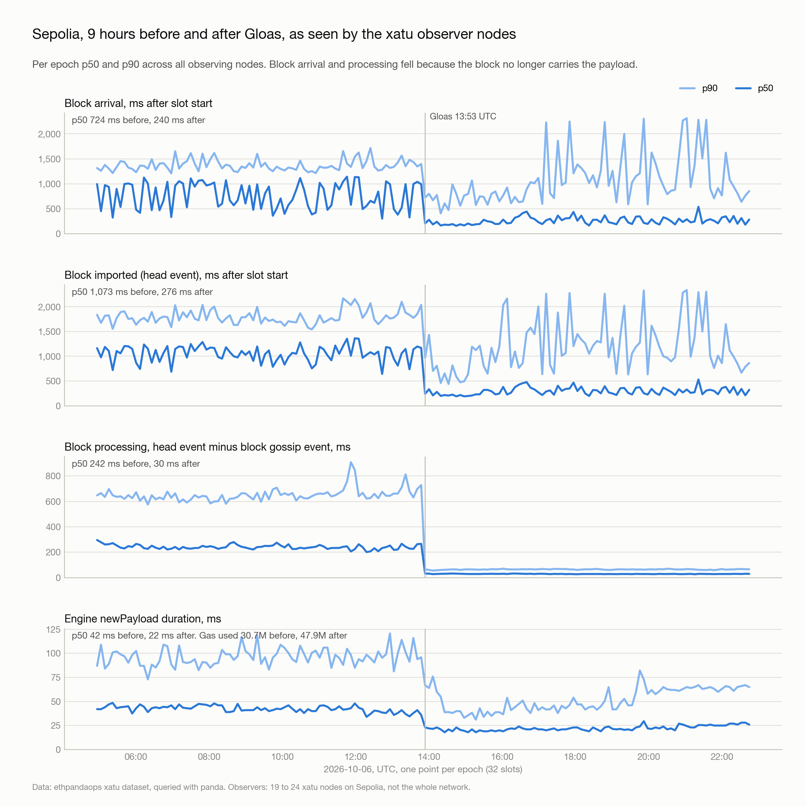
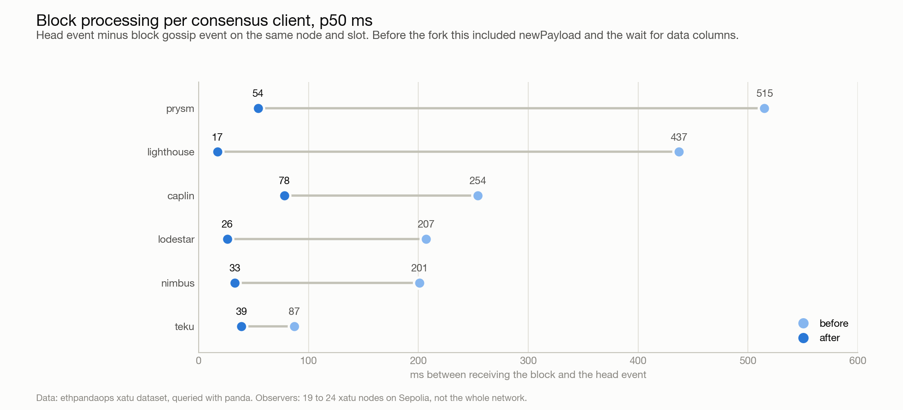
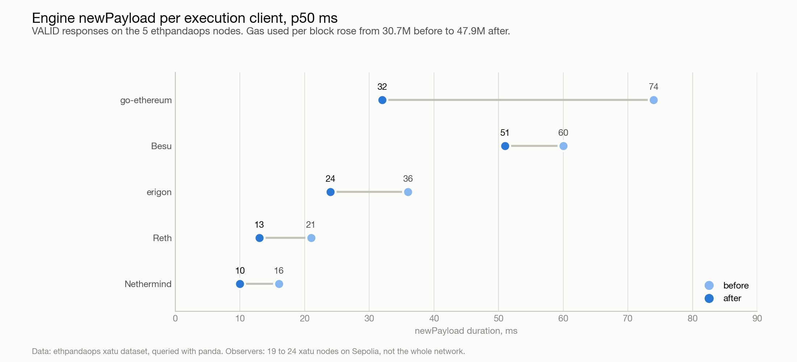
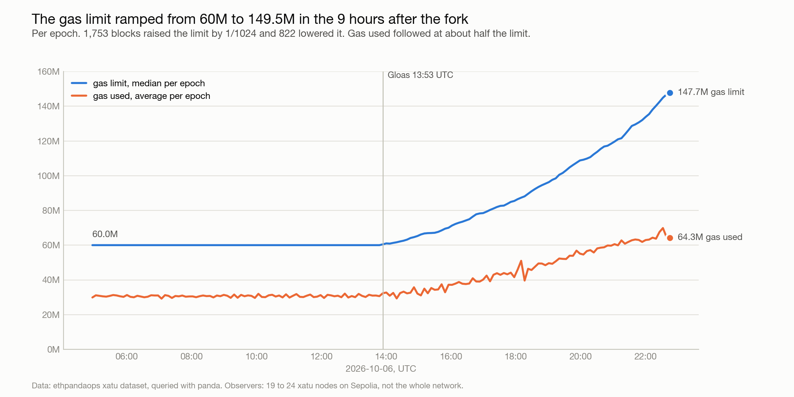

Larger blocks take longer to download and validate. To scale Ethereum, nodes need more time to do that work, and ways to do it more efficiently. [Glamsterdam](https://blog.ethereum.org/2026/09/17/glamsterdam-testnet-announcement) improves both. [ePBS](https://eips.ethereum.org/EIPS/eip-7732) separates the beacon block from the execution payload, letting payload download and validation use more of the slot. [BALs](https://eips.ethereum.org/EIPS/eip-7928) let execution clients read state and validate transactions in parallel. ePBS gives execution more time, and BALs let clients do more with that time.

Now Glamsterdam is on Sepolia, we can start measuring what this means for scaling. This post compares the first nine hours after the fork with the nine hours before it, focusing on beacon block arrival, beacon block processing, and payload validation as the gas limit increases.

Glamsterdam's consensus layer fork, Gloas, activated at 13:53:36 UTC on 6 October 2026, epoch 353024. We compare 2,700 slots on each side.

Thanks to ethpandaops for the [xatu dataset](https://github.com/ethpandaops/xatu). We used panda to query its gossip and client event data from Sepolia nodes.

Start with the beacon block. Its median arrival time (p50) fell from 724 to 240 ms after slot start.

| Beacon block arrival | Before, ms | After, ms |
| --- | --- | --- |
| p50 | 724 | 240 |
| p90 | 1,356 | 1,007 |
| p99 | 2,382 | 2,405 |

The median fell by 66.9%, and every consensus client in the data had a lower median. The improvement was smaller at p90, while p99 stayed above 2,300 ms.

Separating the payload leaves a smaller beacon block to broadcast. Its median gossip size fell from 34,876 to 1,630 bytes. The transactions now travel separately, so nodes can receive the beacon block without waiting for all the execution data to arrive with it.

These arrival times are measured from slot start. We do not have broadcast timestamps, so they cannot tell us the propagation delay alone. The nine hours before the fork also included 419 relay blocks, which arrived at 1,254 ms p50, compared with 472 ms for locally built blocks.

Once the beacon block arrives, there is also less work to do before it becomes head. The interval from the block gossip event to the head event fell from 242 to 30 ms p50, and from 646 to 65 ms p90.

Before the fork, the consensus client waited for payload validation through the Engine API `newPayload` call, which took 42 ms p50 from request to `VALID` response. It also waited for data column sidecars, which arrived at 932 ms p50 after slot start versus 724 ms for the beacon block. With ePBS, neither step delays the head event as the execution workload grows.

The `newPayload` call also became faster, even as gas used per payload increased.

| `newPayload` duration | Before, ms | After, ms |
| --- | --- | --- |
| p50 | 42 | 22 |
| p90 | 97 | 56 |
| p99 | 266 | 96 |

The median fell by 47.6%, while average gas used per payload rose from 30.7 million to 47.9 million, an increase of 56.2%.

BALs allow clients to read state and validate transactions in parallel, but this comparison does not isolate their contribution. We have not verified why `newPayload` became faster. Average gas used per payload was higher, while the median `newPayload` duration was lower.

During the nine hours after the fork, the gas limit rose from 60 million to a maximum of 149,479,880.

| Gas measurement | Before, gas | After, gas |
| --- | --- | --- |
| Median gas limit | 60,000,000 | 90,455,595 |
| Maximum gas limit | 60,000,000 | 149,479,880 |
| Average gas used per payload | 30,675,723 | 47,930,982 |

Hourly average gas used per payload rose from 32.5 million in the 14:00 UTC hour to 65.9 million in the partial 22:00 UTC hour. Over the same period, the hourly median `newPayload` duration stayed between 20 and 27 ms.

The gas limit curve ends at 147.7 million because it plots the median of the final full epoch. The 149,479,880 maximum belongs to an individual payload.

The data above comes from the ethpandaops xatu dataset, queried with panda. Beacon API events and libp2p sentries provide receipt times and message sizes, and rpc snooper records Engine API request durations. The timing windows run from 04:53:36 to 13:53:36 UTC and from 13:53:36 to 22:53:36 UTC, with the end of each window excluded. Beacon block arrival measurements cover 24 nodes before the fork and 19 after. Beacon block processing measures the interval from the block gossip event to the head event on the same node and slot. The `newPayload` duration measures the interval from request to `VALID` response. Timing percentiles are over node observations, using ClickHouse `quantile`.
